# MURDERCRAB!
## Player’s manual

> **8-bit shell. 16-bit attitude. Arcade doctrine.**

**This file is the single source of truth for players** — how the cabinet works, controls, HUD, enemies, stages, bosses, score, credits, and high scores.

Operators (design vision, research, cart limits, tuning targets, future features): **[operator-manual.md](operator-manual.md)**.

**Art in this doc:** PNG figures are **16× nearest-neighbor** exports from the cart; see `media/MurderCrab_Media_Extraction_Pack/docs/asset_manifest.json` for sprite IDs. **GIFs** (banking, bullet cycle, enemy idle): `media/MurderCrab_Media_Extraction_Pack/assets/gifs/`. **Optional PDF booklet:** [MurderCrab_Designed_Manual.pdf](MurderCrab_Designed_Manual.pdf) (design export; this markdown stays authoritative).

---

## Contents

1. Warning to New Pilots  
2. What *MurderCrab* Is  
3. Mission Brief *(flavor)*  
4. How the Cabinet Works  
5. Basic Controls  
6. HUD Readout  
7. Core Combat Systems  
8. Resources  
9. Enemy Field Guide  
10. Stage Guide  
11. Boss Doctrine  
12. Score Attack  
13. Credits and Continues  
14. High Scores  

---

# 1. WARNING TO NEW PILOTS

This is an arcade shooter.

Your first objective is simple: **stay alive long enough to understand the stage.**

Your second objective is more important: **learn why the stage is built the way it is.**

Your third objective is where the good stuff starts: **turn survival into authority.**

Clearing proves you can live. A route proves you can drive.

---

# 2. WHAT *MURDERCRAB* IS

**MurderCrab!** is a vertically scrolling arcade shooter built for PICO-8. Five stages of escalating swarm density, two bosses per level, a true last boss gated behind skilled play, and a new game plus loop for pilots who want to push further. The **feel** is quarter-muncher: credits, continues, a top-3 board, and no campaign unlocks -- even though you pick options from a menu between the title and play.

The game runs at 128x128 resolution with 16 colors, 8x8 base sprites, and a single combined cartridge. Built within PICO-8's 8,192-token and 32KB cart constraints.

> Humanity did not find peace in the void.
> It found armored claws, chitin cathedrals, and wave after wave of shell-born murder.
> Launch. Learn the lanes. Burn through the swarm.

---

# 3. MISSION BRIEF *(flavor)*

**The outer shells have opened.** At the edge of charted space, broken stations became nesting ground for a mechanized crab-host: waves, cruel geometries, strongholds that molt and harden. One compact craft answers — **MURDERCRAB** — enough output and a pilot mad enough to fly it into the choke.

**Field note.** The enemy does not advance like an army. It spreads like a bad idea.

---

# 4. HOW THE CABINET WORKS

This is an arcade shooter. Think in quarters.

## What you actually see (current build)

**Title screen.** Logo, scrolling starfield, a big crab boss tease, and "press any button." Credits reset to **3** every time you land here.

**Main menu.** Four options: start game, enter initials, instructions, high scores. Your remaining credits show at the bottom. **Start game** costs 1 credit and launches the warp into level 1.

**During play.** When you die, **game over** appears with **Z to continue** (if you have credits) or **X for menu**. A **10-second** countdown runs; if it hits zero, you go to the menu. Continuing costs 1 credit, gives you **3 HP**, and **resets your multiplier and streak**. Any continue **locks out** the true last boss for that run.

**High scores.** Your score (including the end-of-run bonus) is checked **as soon as game over begins**. If you rank in the **top 3**, the board updates using whatever **3-character initials** you have saved (defaults start as **ACE** until you change them under **enter initials** on the menu). There is **no** separate "you made the board, type your name now" moment after death -- set your tag **before** the run if you care.

**After a run.** You return to the **menu** (not straight back to the title). From there you can start again, read instructions, or quit to the title with **X**.

**Victory / NG+.** After the true last boss, **Z** starts the next loop on the same "life" of the run; **X** exits to the menu.

## The mental model (one sentence)

You get **3 credits** per visit to the title screen: **1** to start, up to **2** more if you want harsh continues. No real-money quarters -- but the rhythm is "short runs, cheap retries, chase the board."

---

# 5. BASIC CONTROLS

| Input | Action |
|-------|--------|
| Arrow keys / D-pad | Move ship |
| Z (button 4) | Shoot |
| X (button 5) | Bomb |

**Movement** is digital at 2 pixels per frame in all four directions. No inertia, no acceleration. Diagonals move at full speed on both axes.

**Shoot** fires twin bullets from either side of the ship. The cart uses PICO-8's **`btnp`** on Z: you get a volley on the first press, and the engine **repeats** the button while you hold it (same as most PICO-8 games). You can tap for single bursts or **hold for rapid fire**. Bullets travel upward at 6 pixels per frame.

**Bomb** is your panic button and your tactical tool. Details in section 7.

There is no focus mode, no secondary fire, and no charge mechanic. Three inputs. That's the whole cockpit.

**Operator tip.** Beginners over-move. Good players move enough. Great players move exactly once.

### Ship art *(exports 16×, nearest-neighbor)*

| Bank left | Idle | Bank right |
|:---:|:---:|:---:|
| 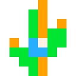 | 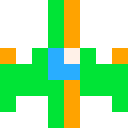 | 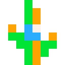 |

**Twin shot — graphic frames**

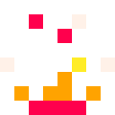
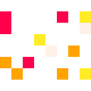

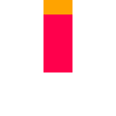

---

# 6. HUD READOUT

The HUD displays during gameplay along the top and left edges of the screen:

```
SCORE: 1,240          HI: 5,680
HEALTH: 97
BOMBS: 3
LEVEL: 2
x3 (7/10)
```

| Element | Location | Details |
|---------|----------|---------|
| **Score** | Top left | Current score, comma-formatted for large values |
| **Hi-Score** | Top right | Best score from the high score table. Flashes gold/orange when your current score beats it |
| **Health** | Below score | Current HP. Flashes red when at 2 or below |
| **Bombs** | Below health | Remaining bomb stock |
| **Level** | Below bombs | Current level number. Shows "3-2" format in NG+ (level 3, loop 2) |
| **Multiplier** | Below level | Current multiplier and streak progress toward next increase (e.g. "x3 (7/10)") |

### Boss warning

When a boss is about to spawn, **"! WARNING !"** flashes at center screen for 3 seconds (90 frames), alternating red and yellow.

### Game over overlay

When health reaches zero, **game over** appears mid-screen. After a short grace period: **Z** continues (costs 1 credit, only if credits remain), **X** sends you to the **menu**. The overlay shows **credits** left and a **countdown in seconds** so you are not guessing. **Z: continue** only appears when you have at least one credit. A **10-second** countdown runs in the background; if it expires, you go to the menu automatically.

---

# 7. CORE COMBAT SYSTEMS

## 7.1 Movement

The ship moves at a fixed 2 pixels per frame. The player hitbox for enemy bullet collisions is a tight 2x2 pixel box centered on the ship sprite -- much smaller than the visual 8x8 sprite. This means you can thread through gaps that look impossible.

For **kamikaze** (dive) collisions, the game uses **full 8×8 ship bounds vs full enemy body** — rams are not the same puzzle as bullet threading.

The ship tilts left or right while strafing and displays a small exhaust thrust animation while moving in any direction.

## 7.2 Shot

Each time the fire input triggers (press or repeat while held), Z spawns two bullets simultaneously, offset to the left and right of the ship's center. Bullets are 8x8 sprites with a 5-frame looping animation. They travel straight up at 6 pixels per frame and despawn when they leave the top of the screen.

There is no weapon power system. Your gun is the same from the first second to the last.

## 7.3 Bomb

Press X to detonate a bomb. Requirements: at least 1 bomb in stock, and no bomb currently active.

**What the bomb does:**
- Clears **all enemy bullets** from the screen instantly
- Clears **all player bullets** from the screen
- Deals **30 damage** to every boss-type enemy on screen
- Instantly kills all normal enemies on screen (they have 1 HP on loop 1)
- Grants a brief period of screen control with visual flash and expanding shockwave
- Creates 3 expanding explosion rings centered on the player
- Triggers heavy screen shake (20 frames)

**Bomb duration:** 30 frames (1 second at 30fps). During this time, the bomb is "active" and you cannot fire another.

**Bomb effect:** An additional 30-frame visual effect follows -- a white screen flash, contracting circle, and secondary shake pulses.

Bombs are not an apology. They are a conversion mechanic. Use them before death, not after regret.

## 7.4 Invincibility

When hit, the player becomes invincible for 30 frames (1 second). The ship flickers during this window. Use it to reposition.

---

# 8. RESOURCES

## Health

- **Starting HP:** 100
- **Damage per hit:** 1 (from enemy bullets or enemy contact)
- **Health pickup:** restores 1 HP
- **No maximum cap** -- health can exceed 100 through pickups

100 HP is generous. You can absorb many hits before dying. But multiplier resets on every hit, so taking damage is expensive even when it isn't lethal.

## Bombs

- **Starting stock:** 3
- **Bomb pickup:** adds 1 bomb
- **No maximum cap**

## Credits

- **Starting credits:** 3
- **Cost to start:** 1 credit
- **Continue cost:** 1 credit
- **Continue restores:** 3 HP

Continuing is harsh by design. You get 3 more hits, not a fresh start. It's enough to see what's ahead, not enough to coast.

**Important:** using any continues locks you out of the true last boss. A no-continue clear is required to reach level 6.

## Powerups

Defeated normal enemies have a **90% chance** to spawn a powerup burst: 2-4 cherry (score) pickups that scatter outward, plus a **5% chance** of an additional bomb or health pickup.

| Powerup | Sprite | Effect |
|---------|--------|--------|
| Cherry | 7 | +100 points (x multiplier), +1 streak progress |
| Health | 6 | +1 HP |
| Bomb | 5 | +1 bomb |

Cherries have a **30-frame lifespan** and will expire with a small flash if not collected. They blink when about to expire (last 15 frames).

All powerups are attracted toward the player when within 48 pixels. They drift toward you -- you don't have to fly directly over them.

### Pickup icons

| Bomb | Health | Cherry |
|:---:|:---:|:---:|
| 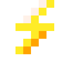 |  | 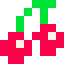 |

**Cherry law.** Chasing a cherry that kills you is not scoreplay. Preserving the route usually preserves more score.

---

# 9. ENEMY FIELD GUIDE

## Normal enemies

One core enemy type with two weapon variants and three behavior states.

**Field note.** Most “reflex deaths” are positioning errors from one or two seconds earlier.

### Sprites *(normal + bullet + dive)*

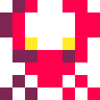
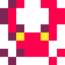
 (dive)


### Behavior states

**State 0 -- Entry:** Enemy spawns above the screen and descends toward a randomized hover point (y = 20-35). Drifts slightly left or right during descent. Already firing during this state.

**State 1 -- Hover:** Enemy patrols horizontally, bouncing off screen edges. Fires at the player. After a 45-frame timer expires, transitions to kamikaze.

**State 2 -- Kamikaze:** Enemy locks onto the player's position and dives at double speed. Sprite changes to the dive sprite. If it misses, it flies off-screen and despawns.

### Weapon variants (50/50 chance)

**Shotgun:** Fires 3 bullets in a spread pattern aimed at the player. Bullet speed 4.5 px/frame, spread angle 10 degrees.

**Burst:** Fires 3 rapid aimed shots in sequence with a 3-frame delay between each. Bullet speed 5 px/frame.

### Scaling

| Property | Base (Level 1) | Per level | Per NG+ loop |
|----------|----------------|-----------|--------------|
| Speed | 2.0 | +0.4 | +0.3 |
| Max speed | 3.5 | -- | +0.5 |
| Shoot interval | 60 frames | -4 | -6 to -8 |
| Min shoot interval | 40 frames | -- | decreases further |
| HP | 1 | -- | +1 per loop |
| Spawn count | 1 | 2 at level 4+ | -- |
| Spawn delay | 75 frames | -6 | -5 |

## Bosses

See section 11 for full boss doctrine.

---

# 10. STAGE GUIDE

## Progression structure

Each of the 5 levels follows the same structure:

1. **Normal phase (pre-mini-boss):** Kill enemies to reach the mini-boss threshold
2. **Boss warning:** 3-second flashing warning
3. **Mini-boss fight**
4. **Normal phase (post-mini-boss):** Kill more enemies to reach the final boss threshold
5. **Boss warning**
6. **Final boss fight**
7. **Level complete:** Cinematic explosion sequence, then warp to next level

### Kill thresholds

| Level | Mini-boss threshold | Final boss threshold |
|-------|-------------------|---------------------|
| 1 | 8 kills | 12 kills |
| 2 | 12 kills | 15 kills |
| 3 | 16 kills | 18 kills |
| 4 | 20 kills | 21 kills |
| 5 | 24 kills | 24 kills |

Kill count resets after each boss defeat.

### Boss count per level

| Level | Mini-bosses | Final bosses |
|-------|-------------|-------------|
| 1 | 1 | 1 |
| 2-5 | 2 | 2 |

## Stage aesthetics

Each level has a distinct starfield that communicates depth and escalation:

| Level | Background | Star colors | Density | Feel |
|-------|-----------|-------------|---------|------|
| 1 | Black | White | 90 stars | Clean void. Training ground. |
| 2 | Dark blue | White, light blue, blue-grey | 100 stars | Deeper space. Colder. |
| 3 | Dark green | White, green, dark green | 110 stars | Biological territory. Something alive out here. |
| 4 | Dark purple | White, blue-grey, pink, dark blue | 120 stars | Approaching the hive. Colors shifting. |
| 5 | Dark red | White, yellow, blue-grey, light blue | 130 stars | The core. Everything is wrong. |
| 6 (TLB) | Shifting | All colors | 150 stars | Hyperspace. Reality breaking. |

Star scroll speed increases with level. Stars twinkle more aggressively in later levels.

## Warp transition

Between levels, a 6-second warp sequence plays: stars streak into lines, the screen flashes, and the level number displays mid-transition. During warp, the player's position resets to center and all bullets are cleared.

---

# 11. BOSS DOCTRINE

Bosses in *MurderCrab* are exams, not spectacles.

### Boss composites *(export canvas 32×32 px; 2×2 / 4×4 tiles in-game)*

**Mini / final (shared family):**  
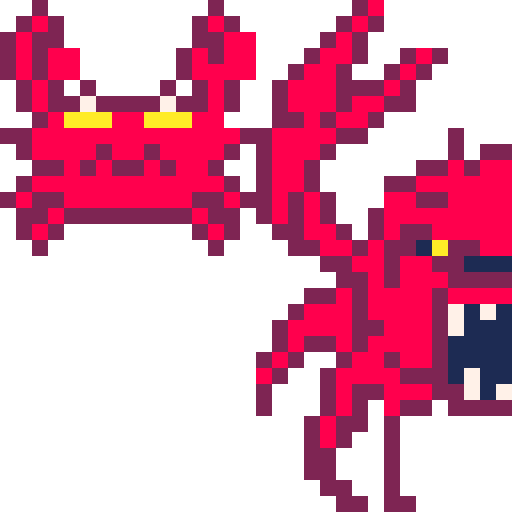

**True last boss:**  
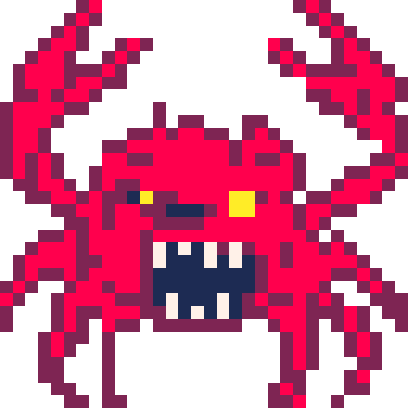

Full **GFX sheet** snapshot: `media/MurderCrab_Media_Extraction_Pack/assets/raw/spritesheet_from_code.png`.

## Mini-boss

- **Sprite:** 2x2 tile (16x16 pixels)
- **Base HP:** 60 (+5 per level, x1.5 per NG+ loop)
- **Phases:** 2 (transition at 50% HP)
- **Shoot interval:** 30 frames (decreases per phase)
- **Score:** 50 points
- **Movement:** Enters from top, strafes horizontally within a 60-pixel range centered on screen

### Level 1 HP reference

| Loop | Mini-boss HP |
|------|-------------|
| 1 | 60 |
| 2 | 90 |
| 3 | 120 |

## Final boss

- **Sprite:** 2x2 tile (16x16 pixels), palette-shifted to distinguish from mini-boss
- **Base HP:** 100 (+5 per level, x1.5 per NG+ loop)
- **Phases:** 3 (transitions at 66% and 33% HP)
- **Shoot interval:** 12 frames (decreases per phase)
- **Score:** 100 points
- **Movement:** Enters from top, strafes horizontally (slower than mini-boss, dx=0.3 vs 0.5)

### Level 1 HP reference

| Loop | Final boss HP |
|------|--------------|
| 1 | 100 |
| 2 | 150 |
| 3 | 200 |

## True last boss

- **Sprite:** 4x4 tile (32x32 pixels)
- **Condition:** Beat all 5 levels without using any continues
- **Base HP:** 450 (x1.5 per NG+ loop)
- **Phases:** 3 (transitions at 66% and 33% HP)
- **Rage mode:** Activates at phase 3. Visual aura appears, +10 bullets added to every pattern
- **Shoot interval:** 10 frames (decreases per phase, minimum 3)
- **Score:** 50 points
- **Movement:** Strafes horizontally

## Boss attack patterns

All bosses share the same pattern system, cycling between three attack types:

**Spiral:** Bullets spawn in a rotating spiral. Count scales with level and boss damage. Wobbles slightly with a sine offset for unpredictability.

**Radial burst:** Bullets fire in an even radial spread from the boss center. Clean geometric pattern that demands positioning.

**Aimed burst:** 3-shot aimed burst directly at the player. Fast and precise. Tests streaming ability.

Pattern selection rotates based on game time and boss phase. Higher phases cycle faster and unlock all three pattern types (phase 1 only uses spiral and radial).

Bullet speed scales with level (+0.15 per level) and boss damage state (+0.3 at low HP). More damaged bosses shoot faster bullets in denser patterns.

## Boss defeat

When the last boss of a type is destroyed:
- All enemy bullets convert to small explosions (visual reward + safety)
- Cinematic explosion chain at the boss position
- Heavy screen shake
- Music fades out

For the final boss, a 90-frame (3 second) explosion celebration plays with periodic secondary detonations before the level warp begins.

---

# 12. SCORE ATTACK

## Point values

| Source | Base value | Notes |
|--------|-----------|-------|
| Normal enemy kill | 10 | Multiplied by current multiplier |
| Cherry pickup | 100 | Multiplied by current multiplier |
| Mini-boss kill | 50 | Multiplied by current multiplier |
| Final boss kill | 100 | Multiplied by current multiplier |
| TLB kill | 50 | Multiplied by current multiplier |

## Multiplier system

The multiplier starts at x1 and increases through cherry collection:

1. Kill enemies. They drop 2-4 cherries on death (90% chance).
2. Collect cherries to build streak. Each cherry = +1 streak.
3. Every **10 cherries** collected increases the multiplier by 1.
4. **Getting hit resets both multiplier and streak to zero.**

The multiplier applies to all point sources: kills, pickups, and boss defeats.

### Multiplier strategy

The multiplier is the entire scoring game. A x5 multiplier means every kill is worth 50 instead of 10. Every cherry is worth 500 instead of 100.

**The cost of getting hit is not the 1 HP you lose. It's the multiplier you drop.**

Playing for score means playing for streaks. That means positioning to collect cherries efficiently, avoiding damage above all else, and using bombs proactively to protect the multiplier rather than reactively to survive.

## End-of-game bonus

When the game ends (victory or game over), a bonus is calculated:

```
bonus = (remaining bombs x 25) + (remaining health x 25)
```

On a clean loop 1 clear with 100 HP and 3 bombs remaining, that's a 2,575 point bonus. Every bomb you don't use and every hit you don't take pays off at the end.

## High score persistence

The game stores the top 3 high scores with 3-character initials using PICO-8's cartdata system. Scores are stored in component form (millions / thousands / units) across 6 cartdata slots per entry to handle large values. Your initials are also persisted between sessions.

---

# 13. CREDITS AND CONTINUES

## Credits

You get 3 credits per session. Think of them as quarters.

Choosing **start game** from the menu costs 1 credit. Credits reset to **3** every time you return to the **title** screen (from the menu).

## Continuing

When you die:
- A 10-second timer (300 frames) begins counting down
- After a brief grace period, press Z to continue (costs 1 credit) or X to end the run
- Continuing restores 3 HP and resets your multiplier and streak
- If the timer expires, the run ends automatically

Continuing is harsh by design. You get 3 more hits, not a fresh start. Enough to see what's ahead, not enough to coast.

## True ending condition

The true last boss only appears if you used zero continues. Any continue disqualifies you. After beating level 5's final boss without continuing, you warp to level 6 for the TLB encounter.

If you used continues, level 5's final boss defeat goes directly to the game complete screen.

## New Game Plus

After defeating the TLB, press Z to enter the next loop. This is not a new game -- it's the game continuing on the same credit. Score carries over. HP and bombs carry over. Enemies get harder.

NG+ scaling per loop:
- Enemy HP: +1 per loop
- Enemy speed: +0.3 base, +0.5 max
- Enemy shoot interval: reduced by 6-8 frames
- Spawn delay: reduced by 5 frames
- Boss HP: x1.5 per loop
- Boss bullet clusters: +1 per level (additive with base scaling)

During an NG+ chain you keep playing until you die or exit from the victory screen. When you are out of credits on game over, the timer eventually returns you to the menu.

---

# 14. HIGH SCORES

## The board

The high score table holds **3** entries. View them anytime from **high scores** on the main menu.

## Entering initials

From the menu, choose **enter initials** to set your **3-character** tag. Up/down changes the character (printable ASCII, codes 33-126), left/right moves between positions, **Z** confirms, **X** cancels.

Your initials are **saved** and used automatically whenever your run qualifies for the board. They persist between sessions. If you never change them, defaults apply until you do.

**Tip for first-timers:** Set your initials **before** a serious run so the leaderboard shows *you*, not the default.

## When scores are recorded

The game computes **final score** (current score + end bonus) and updates the table at:
- **Game over** -- checked on the first frame of the countdown
- **True last boss defeat** (victory path)

If you qualify for top 3, your **saved** initials are written with that score. You then continue from **menu** or **title** as usual -- there is no mandatory name-entry screen after death in the current build.

### Player glossary *(quick)*

| Term | Meaning |
|------|---------|
| **TLB** | True last boss (stage 6) |
| **No-continue** | Never used continue this run — required for TLB |
| **Route** | Planned path through a wave or stage |
| **Cherry chain** | Streak toward the next multiplier step |

**Hitboxes** (bullets vs you: **2×2** centered in the ship; kamikaze ram: **full ship vs enemy**): full tables and **cart limits** live in **[operator-manual.md](operator-manual.md)** (cart budget + implementation notes).

---

> **THE SWARM IS LEARNING. SO ARE YOU.**
> Route five stages of shell-born violence. Cash power. Spend bombs before regret.
> Push for the clear, then come back for the score.
